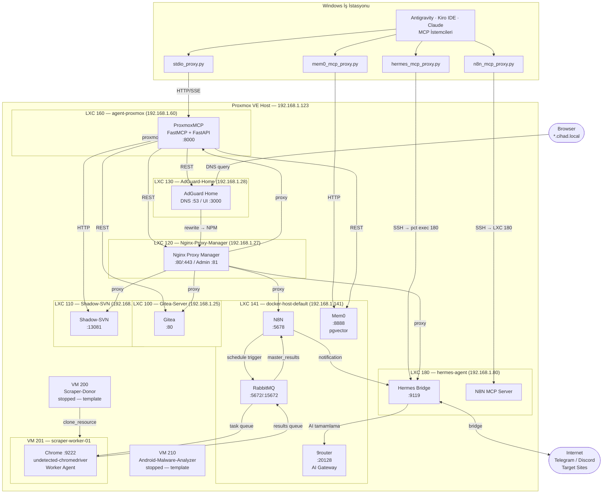

# Diagram 1 — Network & Service Topology

```mermaid
graph TB
    subgraph WS["Windows İş İstasyonu"]
        KIRO["Antigravity · Kiro IDE · Claude\nMCP İstemcileri"]
        P1["stdio_proxy.py"]
        P2["hermes_mcp_proxy.py"]
        P3["n8n_mcp_proxy.py"]
        P4["mem0_mcp_proxy.py"]
    end

    subgraph PVE["Proxmox VE Host — 192.168.1.123"]
        subgraph LXC160["LXC 160 — agent-proxmox (192.168.1.60)"]
            MCP["ProxmoxMCP\nFastMCP + FastAPI\n:8000"]
        end

        subgraph LXC130["LXC 130 — AdGuard-Home (192.168.1.28)"]
            AG["AdGuard Home\nDNS :53 / UI :3000"]
        end

        subgraph LXC120["LXC 120 — Nginx-Proxy-Manager (192.168.1.27)"]
            NPM["Nginx Proxy Manager\n:80/:443 / Admin :81"]
        end

        subgraph LXC100["LXC 100 — Gitea-Server (192.168.1.25)"]
            GIT["Gitea\n:80"]
        end

        subgraph LXC110["LXC 110 — Shadow-SVN (192.168.1.26)"]
            SVN["Shadow-SVN\n:13081"]
        end

        subgraph LXC141["LXC 141 — docker-host-default (192.168.1.141)"]
            N8N["N8N\n:5678"]
            RMQ["RabbitMQ\n:5672/:15672"]
            MEM["Mem0\n:8888\npgvector"]
            ROUTER9["9router\n:20128\nAI Gateway"]
        end

        subgraph LXC180["LXC 180 — hermes-agent (192.168.1.80)"]
            HRM["Hermes Bridge\n:9119"]
            N8NMCP["N8N MCP Server"]
        end

        subgraph VMSCRAPER["VM 201 — scraper-worker-01"]
            SCR["Chrome :9222\nundetected-chromedriver\nWorker Agent"]
        end

        VM200["VM 200\nScraper-Donor\nstopped — template"]
        VM210["VM 210\nAndroid-Malware-Analyzer\nstopped — template"]
    end

    INTERNET(["Internet\nTelegram / Discord\nTarget Sites"])

    KIRO --> P1 & P2 & P3 & P4
    P1 -->|HTTP/SSE| MCP
    P2 -->|SSH → pct exec 180| HRM
    P3 -->|SSH → LXC 180| N8NMCP
    P4 -->|HTTP| MEM

    MCP -->|proxmoxer API| PVE
    MCP -->|REST| AG
    MCP -->|REST| NPM
    MCP -->|REST| GIT
    MCP -->|HTTP| SVN
    MCP -->|REST| MEM

    N8N -->|schedule trigger| RMQ
    RMQ -->|task queue| SCR
    SCR -->|results queue| RMQ
    RMQ -->|master_results| N8N
    N8N -->|notification| HRM
    HRM <-->|bridge| INTERNET
    HRM -->|AI tamamlama| ROUTER9

    VM200 -->|clone_resource| VMSCRAPER

    Browser(["Browser\n*.cihad.local"]) -->|DNS query| AG
    AG -->|rewrite → NPM| NPM
    NPM -->|proxy| GIT & SVN & N8N & HRM & MCP
```
