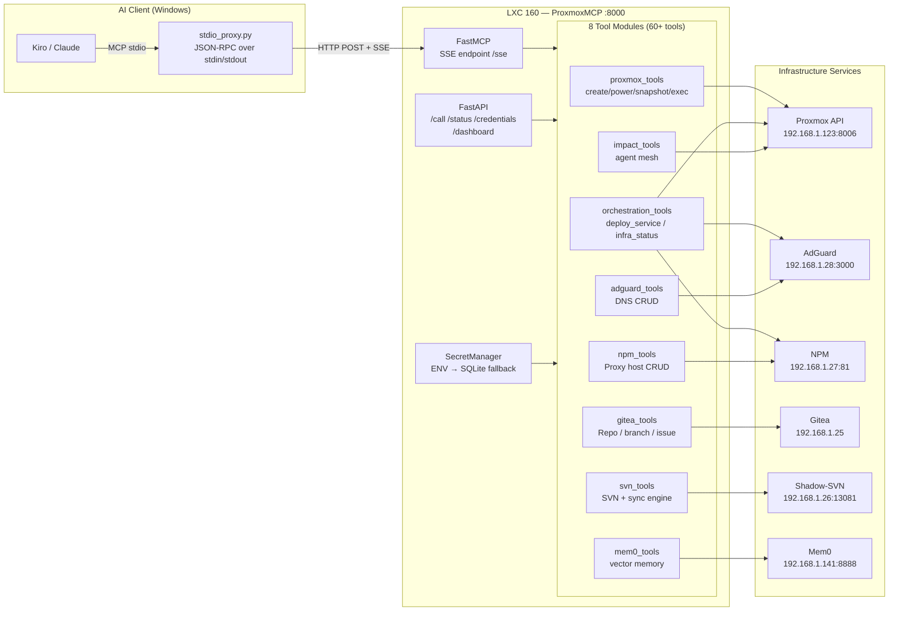

# Diagram 2 — MCP Control Plane Architecture

```mermaid
graph LR
    subgraph CLIENT["AI Client (Windows)"]
        AI["Kiro / Claude"]
        PROXY["stdio_proxy.py\nJSON-RPC over stdin/stdout"]
    end

    subgraph LXC160["LXC 160 — ProxmoxMCP :8000"]
        SSE["FastMCP\nSSE endpoint /sse"]
        API["FastAPI\n/call /status /credentials\n/dashboard"]
        SM["SecretManager\nENV → SQLite fallback"]

        subgraph TOOLS["8 Tool Modules (60+ tools)"]
            T1["proxmox_tools\ncreate/power/snapshot/exec"]
            T2["orchestration_tools\ndeploy_service / infra_status"]
            T3["adguard_tools\nDNS CRUD"]
            T4["npm_tools\nProxy host CRUD"]
            T5["gitea_tools\nRepo / branch / issue"]
            T6["svn_tools\nSVN + sync engine"]
            T7["mem0_tools\nvector memory"]
            T8["impact_tools\nagent mesh"]
        end
    end

    subgraph SERVICES["Infrastructure Services"]
        PVE_API["Proxmox API\n192.168.1.123:8006"]
        ADGUARD["AdGuard\n192.168.1.28:3000"]
        NPMAPI["NPM\n192.168.1.27:81"]
        GITEA["Gitea\n192.168.1.25"]
        SVNAPI["Shadow-SVN\n192.168.1.26:13081"]
        MEM0["Mem0\n192.168.1.141:8888"]
    end

    AI -->|MCP stdio| PROXY
    PROXY -->|HTTP POST + SSE| SSE
    SSE --> TOOLS
    API --> TOOLS
    SM --> TOOLS

    T1 --> PVE_API
    T2 --> PVE_API & ADGUARD & NPMAPI
    T3 --> ADGUARD
    T4 --> NPMAPI
    T5 --> GITEA
    T6 --> SVNAPI
    T7 --> MEM0
    T8 --> PVE_API
```
