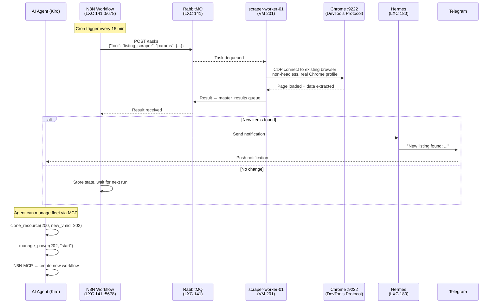

# Diagram 3 — Web Monitoring Bot Flow

```mermaid
sequenceDiagram
    participant AGENT as AI Agent (Kiro)
    participant N8N as N8N Workflow<br/>(LXC 141 :5678)
    participant RMQ as RabbitMQ<br/>(LXC 141)
    participant WORKER as scraper-worker-01<br/>(VM 201)
    participant CHROME as Chrome :9222<br/>(DevTools Protocol)
    participant HERMES as Hermes<br/>(LXC 180)
    participant TG as Telegram

    Note over N8N: Cron trigger every 15 min

    N8N->>RMQ: POST /tasks<br/>{"tool": "listing_scraper", "params": {...}}
    RMQ-->>WORKER: Task dequeued

    WORKER->>CHROME: CDP connect to existing browser<br/>non-headless, real Chrome profile
    CHROME-->>WORKER: Page loaded + data extracted

    WORKER->>RMQ: Result → master_results queue
    RMQ-->>N8N: Result received

    alt New items found
        N8N->>HERMES: Send notification
        HERMES->>TG: "New listing found: ..."
        TG-->>AGENT: Push notification
    else No change
        N8N->>N8N: Store state, wait for next run
    end

    Note over AGENT: Agent can manage fleet via MCP
    AGENT->>AGENT: clone_resource(200, new_vmid=202)
    AGENT->>AGENT: manage_power(202, "start")
    AGENT->>AGENT: N8N MCP → create new workflow
```
