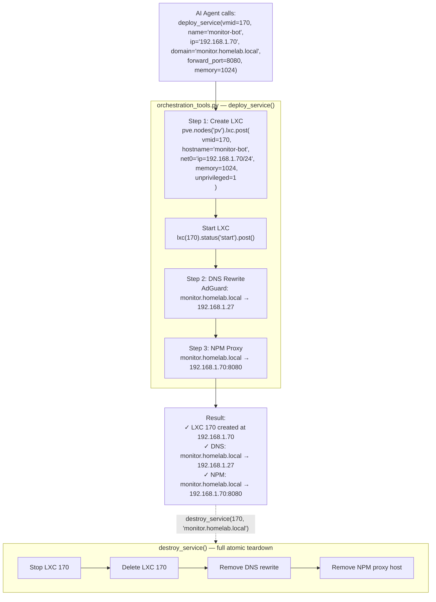

# Diagram 4 — deploy_service() One-Call Provisioning

```mermaid
flowchart TD
    A["AI Agent calls:\ndeploy_service(vmid=170, name='monitor-bot',\nip='192.168.1.70', domain='monitor.homelab.local',\nforward_port=8080, memory=1024)"] --> B

    subgraph ORCH["orchestration_tools.py — deploy_service()"]
        B["Step 1: Create LXC\npve.nodes('pv').lxc.post(\n  vmid=170, hostname='monitor-bot',\n  net0='ip=192.168.1.70/24',\n  memory=1024, unprivileged=1\n)"]
        B --> C["Start LXC\nlxc(170).status('start').post()"]
        C --> D["Step 2: DNS Rewrite\nAdGuard: monitor.homelab.local → 192.168.1.27"]
        D --> E["Step 3: NPM Proxy\nmonitor.homelab.local → 192.168.1.70:8080"]
    end

    E --> F["Result:\n✓ LXC 170 created at 192.168.1.70\n✓ DNS: monitor.homelab.local → 192.168.1.27\n✓ NPM: monitor.homelab.local → 192.168.1.70:8080"]

    subgraph TEARDOWN["destroy_service() — full atomic teardown"]
        G["Stop LXC 170"]
        G --> H["Delete LXC 170"]
        H --> I["Remove DNS rewrite"]
        I --> J["Remove NPM proxy host"]
    end

    F -.->|"destroy_service(170, 'monitor.homelab.local')"| TEARDOWN
```
